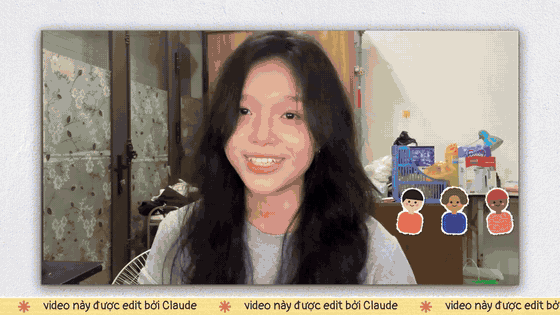
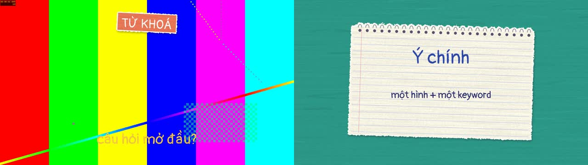
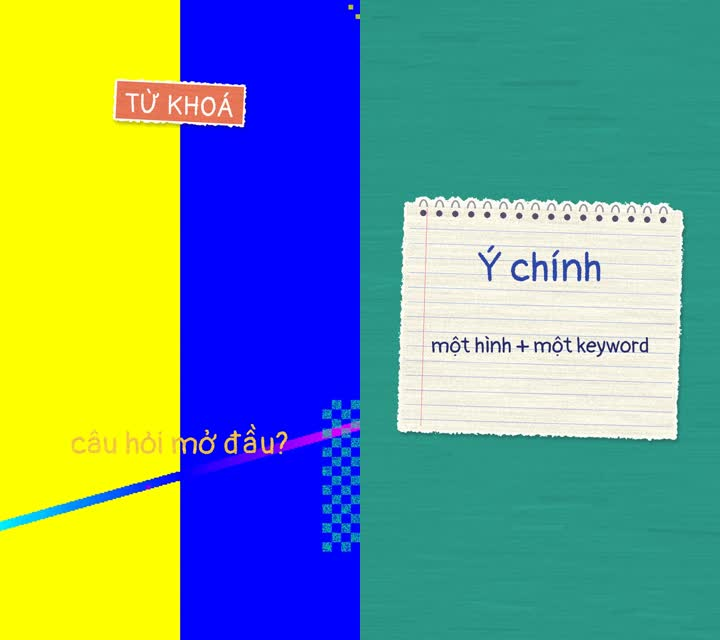

# paper-collage-edit — Claude Code skill

Edit video người nói **16:9 (YouTube) và 9:16 (TikTok/Reels/Shorts)** theo style **cắt dán giấy xé** (viền giấy trắng, bút sáp, chữ viết tay, stop-motion 12fps, chuyển cảnh xé giấy, ảnh dán băng dính, tách nền người) — hoàn toàn bằng Python + ffmpeg.

## Demo


🎬 **Video demo đầy đủ (79s, không tiếng):** [docs/demo-skool.mp4](docs/demo-skool.mp4) — cắt từ video giới thiệu cộng đồng XMAI – AI Heroes Club trên Skool, edit hoàn toàn bằng skill này.

Kết quả `scripts/template.py` ở hai khổ (trái 16:9, phải 9:16):




## Cài đặt
1. Giải nén thư mục `paper-collage-edit` vào:
   - Windows: `C:\Users\<tên bạn>\.claude\skills\`
   - macOS/Linux: `~/.claude/skills/`
2. Cài ffmpeg và thư viện Python:
   `pip install pillow numpy scipy faster-whisper mediapipe rembg onnxruntime`
3. Mở Claude Code, gửi video + kịch bản và nói: *"edit video này style giấy xé"* (thêm *"khổ dọc 9:16"* nếu làm TikTok/Reels).

## Chạy thử nhanh
```
cd scripts
python template.py input.mp4 out_16x9.mp4 6
PAPER_ASPECT=9:16 python template.py input.mp4 out_9x16.mp4 6
```
(Windows PowerShell: `$env:PAPER_ASPECT="9:16"; python template.py ...`)

## Nội dung
- `SKILL.md` — hướng dẫn cho Claude (quy trình, kỹ thuật, nguyên tắc thẩm mỹ)
- `scripts/render.py` — thư viện hiệu ứng giấy (16:9 + 9:16); `scripts/template.py` — file mẫu tối thiểu; các script phụ (bắt tay, tách nền, tìm ảnh Wikimedia, snapshot QC)
- `examples/` — 7 file dựng mẫu (16:9) từ dự án thật để tham khảo
- `fonts/` — Pangolin, Patrick Hand, Itim (SIL Open Font License)
- `models/hand_landmarker.task` — MediaPipe (Apache 2.0)

## License
Code: MIT. Fonts: SIL OFL. MediaPipe model: Apache 2.0.
